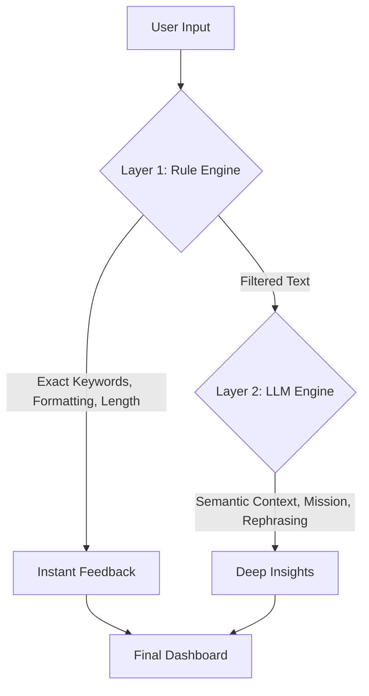

# 🗺️ ATS Forge: The Ultimate Blueprint

This document is the master plan for building **ATS Forge**. It's designed to give collaborators a 100% clear understanding of *what* we are building and *how* we are building it.

---

## 1. The Core Philosophy
> **"Logic First, Design Second."**
Most ATS tools fail because they just look forKeywords. ATS Forge succeeds because it understands **Context**. If a JD asks for "Leadership" and your resume says "Managed a team of 10," a normal tool gives you 0 points. ATS Forge gives you 100 points because it knows they mean the same thing.

---

## 2. The Hybrid Architecture
To maximize **Efficiency** and minimize **Token Cost**, we use a two-speed system:

### 🛠️ Layer 1: The Rule-Based Engine (Python)
*   **Exact Matches**: We'll use a local library of tech skills (Python, Java, React) to find exact matches without calling the API.
*   **Formatting Check**: Rules for font sizes, margins, and complex table detection.
*   **ATS Best Practices**: Checks for "No Pictures" or "Standard Section Headers."

### 🧠 Layer 2: The Intelligence Engine (Gemini 1.5 Pro)
*   **Mission Extraction**: Identifying why the company is hiring.
*   **Semantic Score**: Mapping "Managed teams" to "Leadership" (Rules can't do this).
*   **The Auditor**: Validating bullet points for the STAR method.

### 💻 Layer 3: The Action Workspace
*   **Tool**: Streamlit.
*   **Philosophy**: Clean, focused, and fast.
*   **Live Loop**: When the user edits their resume text in the "Optimization Workspace," the system sends the new text back to the Brain and updates the score instantly.

---

## 4. Technical Deep-Dive

### 📂 Data Flow (The "Handshake")
How data moves between the friend (Developer) and the Brain (AI):
1.  **Input**: `resume_txt`, `jd_txt`.
2.  **Output 1 (JD Blueprint)**: A JSON object containing `{mission, mandatory_skills, preferred_skills, implicit_needs, company_dna}`.
3.  **Output 2 (Match Report)**: A JSON object containing `{ats_score, found_keywords, missing_keywords, star_method_score, improvement_suggestions}`.

### 📝 Example Prompt Logic
*Collaborators should focus on these prompts to tune accuracy:*
> "You are an expert HR Auditor. Analyze the following JD and extract the 'Hidden Mission'. What is the one thing this company *actually* wants to achieve with this hire? Output strictly in JSON format."

---

## 5. Collaborator Onboarding (How to Start)
If you are helping build this, follow these steps in order:
1.  **Clone the Repo**: Get the `ats-forge` folder.
2.  **Install Dependencies**: `pip install streamlit pdfplumber google-generativeai`.
3.  **Get Key**: Ask the project lead for the `.env` file containing the `GEMINI_API_KEY`.
4.  **Run Dev**: `streamlit run app.py` (once we build the first script).

---

## 6. Deployment & Beyond
- **Pushed to GitHub**: For collaboration.
- **Future Feature**: AI Video Interview prep based on the same JD analysis!

**This is the ultimate roadmap. Every line of code we write should serve the goal of making this the most intelligent ATS tool on the market.**
